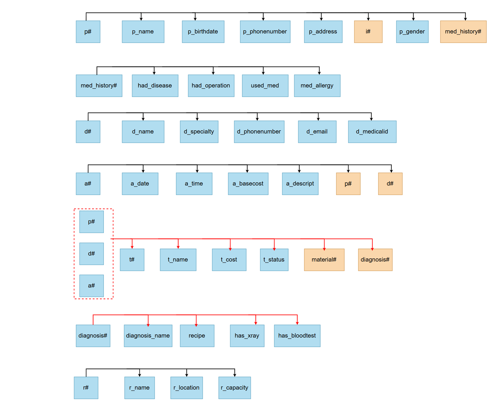
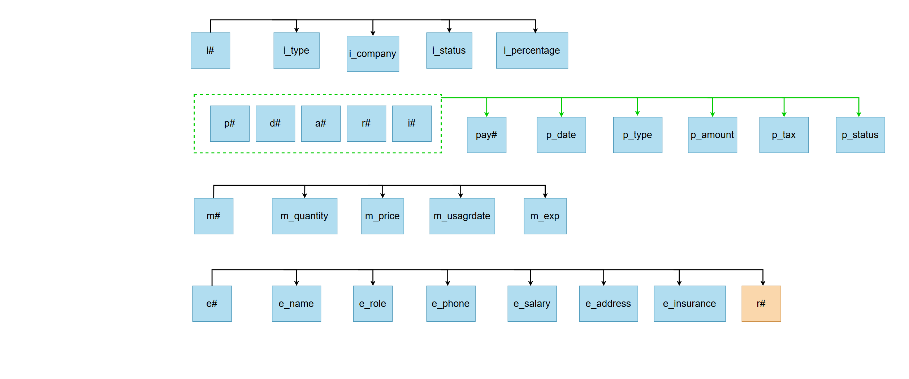

# 🦷 Dental Clinic Management Database

## Overview
This project presents the design and implementation of a relational database system for a dental clinic, covering patient management, appointments, treatments, payments, insurance, and staff.

The database is designed using ER modeling and normalized up to Third Normal Form (3NF) to ensure data integrity and eliminate redundancy.

---

## Objectives
- Model a real-world dental clinic system  
- Apply normalization (1NF → 3NF)  
- Ensure data consistency and integrity  
- Support efficient querying  

---

## Database Design

### ER Diagram

Main entities:
- Patient
- Dentist
- Appointment
- Treatment
- Diagnosis
- Room
- Employee
- Insurance
- Payment
- Medical History

---

## Normalization

### First Normal Form (1NF)

### Second Normal Form (2NF)

### Third Normal Form (3NF)

---

## Implementation
- SQLite database
- Tables with primary & foreign keys
- Fully normalized schema

---

## Features
- Patient & medical history tracking  
- Appointment scheduling  
- Treatment & diagnosis management  
- Insurance handling  
- Payment tracking  

---

## Queries
Includes CRUD operations and complex SQL queries implemented in:

DataBase2ndPhase+Queries.py

---

## Project Structure
- ER PIC.PNG  
- 1NF PIC.PNG  
- 2NF PIC.PNG  
- 3NF-1.PNG  
- 3NF-2.PNG  
- DataBase2ndPhase+Queries.py  
- DB-persian.pdf  

---

## Technologies
- SQLite  
- SQL  
- Python  

---

## Notes
- Focused on database design (no UI)  
- Queries executed via Python  
- Some documentation in Persian  

---

## Author
Maryam Pirzadeh
